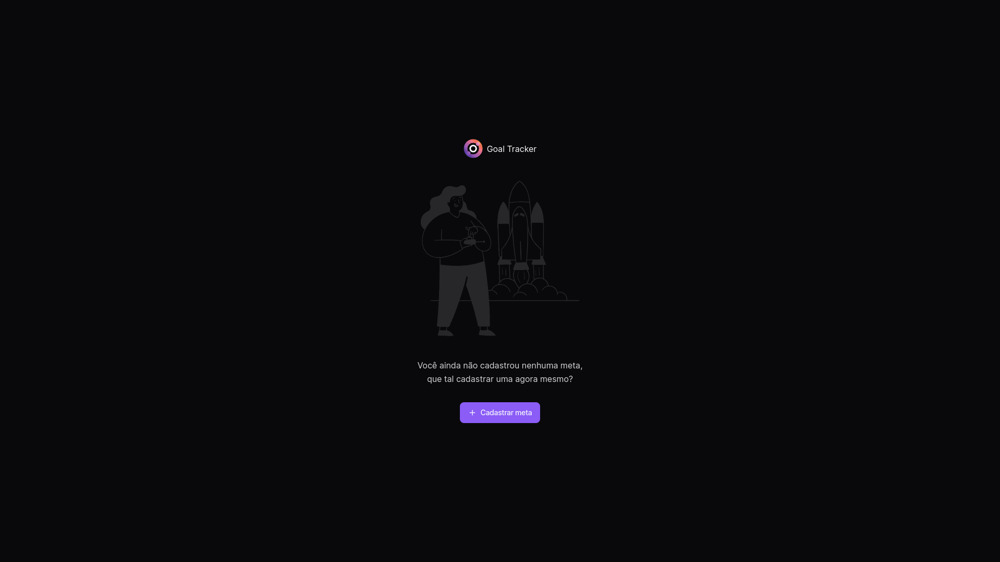

# 🎯 Goal Tracker
Bem-vindo ao repositório do **Goal Tracker!** Este projeto foi desenvolvido para fornecer uma solução eficiente e moderna para o **gerenciamento de metas diárias**. 
Neste sistema é possível:
- Cadastrar novas metas
- Selecionar as que foram executadas no dia
- Acompanhar o resumo semanal das metas completadas



## 💻 Tecnologias utilizadas
- ### Turborepo
  - Gerenciador de múltiplos pacotes em um único repositório, permitindo um desenvolvimento mais organizado e facilitando a manutenção.

- ### Backend
  - **Node.js**: Ambiente de execução JavaScript no lado do servidor, que permite construir aplicações escaláveis e de alto desempenho usando uma arquitetura baseada em eventos e um modelo de I/O não bloqueante.
  - **Typescript**: Superset do JavaScript que adiciona tipagem estática ao código, proporcionando maior segurança e aprimorando o suporte a ferramentas de desenvolvimento em aplicações complexas.
  - **Fastify**: Framework web para Node.js, altamente eficiente e rápido, oferecendo uma experiência de desenvolvimento simples e poderosa para construir APIs e aplicações web.
  - **Zod**: Biblioteca para validação e parsing de esquemas, permitindo definir, validar e inferir tipos de forma segura e declarativa.
  - **Drizzle ORM**: Biblioteca de mapeamento objeto-relacional (ORM) para TypeScript e JavaScript, que fornece uma interface simples e flexível para interagir com bancos de dados SQL de forma tipada e segura, incluindo suporte para Common Table Expression (CTE).
  - **PostgreSQL**: Banco de dados relacional utilizado para armazenar de forma segura e eficiente todos os dados da aplicação.
  - **Docker**: Plataforma para desenvolvimento, envio e execução de aplicações e banco de dados em contêineres.

- ### Frontend
  - **React.js:** Biblioteca Javascript baseada em componentes para construir interfaces de usuário reativas, dinâmicas e escaláveis.
  - **Vite**: Build tool moderno e rápido que oferece um ambiente de desenvolvimento ágil, com carregamento instantâneo de módulos e build otimizado para produção.
  - **Typescript**: Superset do JavaScript que adiciona tipagem estática ao código, proporcionando maior segurança e aprimorando o suporte a ferramentas de desenvolvimento em aplicações complexas.
  - **React Hook Form**: Biblioteca para gerenciamento de formulários, que facilita a manipulação de dados e validação de entradas utilizando hooks de forma eficiente e minimalista.
  - **Zod**: Biblioteca para validação e parsing de esquemas, permitindo definir, validar e inferir tipos de forma segura e declarativa.
  - **React Query**: Biblioteca para gerenciamento de estado assíncrono, que facilita o fetching, caching, sincronização e atualização de dados remotos de forma eficiente.
  - **Tailwind CSS:** Framework CSS utilitário para criação rápida de interfaces de usuário com estilos pré-definidos e altamente personalizáveis.
  - **Radix UI**: Biblioteca de componentes acessíveis e personalizáveis para interfaces de usuário em React, projetada para oferecer usabilidade e estilo flexível.

## 🏛️ Arquitetura e Design Patterns
- **Repository Pattern**: Design pattern de repositório para isolar a lógica de acesso a dados, promovendo uma camada de abstração entre a aplicação e a persistência dos dados. Isso facilita a manutenção e a troca do mecanismo de persistência, se necessário.

## ⚙️ Instalação e Configuração
1. Clone este repositório:
    ```sh
      git clone https://github.com/jairokoning/goal-tracker.git
    ```
2. Navegue até o diretório do projeto:
    ```sh
      cd seu-diretorio/goal-tracker
    ```
3. Instale as dependências:
    ```sh
      yarn install
    ```
4. Configure as variáveis de ambiente no arquivo `.env` utilizando como exemplo o arquivo `.env.example` (no frontend e backend)

5. Acesse a pasta apps/backend e inicie os serviços Docker (você precisa ter o Docker instalado em sua maquina):
    ```sh
      docker-compose up -d
    ```
6. Ainda na pasta apps/backend execute as migrations do Drizzle para criar as tabelas no banco de dados:
    ```sh
      npx drizzle-kit migrate
    ```
7. Na pasta raiz do projeto, inicie a aplicação (front e back):
    ```sh
      yarn run dev
    ```
8. Você poderá acessar a aplicação em: http://localhost:5173


## 🪜 Próximos passos
- [ ] Transformar a aplicação em um SaaS
  - [ ] Cadastro de usuários
  - [ ] Autenticação
- [ ] Testes automatizados
- [ ] Clean Architecture + DDD + SOLID

## ⌨️ Contribuição
Contribuições e sugestões são bem-vindas! Sinta-se à vontade para abrir issues e pull requests para melhorias e correções.

## 💳 Licença
Este projeto está licenciado sob a [licença MIT](./LICENSE).
